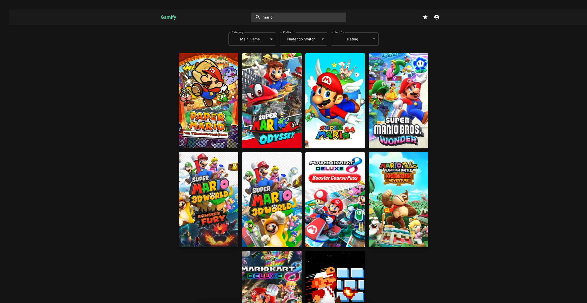

# Gamify
## IBM Application Developer Intern Introduction Project 



> This project got presented as the CRUD introduction project @ IBM Mexico. As an Application Developer Intern I had the opportunity to design, create and subsequently implement this project. The project got showcased on November 5th, 2024.  

### Requirements
- Node v22.9.0
- npm v10.9.0
- Python 3.9.6


### Installation
To run this project, use the following commands:

```
git clone https://github.com/andresdanielmtz/gamify-app
cd gamify-app
npm i
```

In another terminal instance, execute the following commands 

```
git clone https://github.com/andresdanielmtz/gamify-api
cd gamify-api
python3 -m venv .venv
. .venv/bin/activate
pip -r install requirements.txt
```

This will ensure you will have installed all the dependencies necessary to run this project. :) 

### Environment Variables 
In order to run this project you will need the necessary tokens. This project (frontend) requires of the backend endpoint

1. Create an `.env` file and put the following in there:
```
VITE_BACKEND_ENDPOINT = [Backend URL (HTTP / HTTPS)]
VITE_URL_IGDB = [IGDB Endpoint]
VITE_CLIENT_ID = [IGDB Token]
VITE_CLIENT_SECRET = [IGDB Token]
VITE_AUTH_IGDB = [IGDB Token]
VITE_TOKEN_TYPE = [IGDB Token]
VITE_ACCESS_TOKEN = [IGDB Token]
VITE_TOKEN_TYPE=bearer
```

Please refer to [IGDB Documentation](https://api-docs.igdb.com/#getting-started) for more information about how to get IGDB tokens and endpoint. 

2. In `gamify-api`, create an `.env`file too.

```
TEST=HELLOWORLD
CLIENT_ID = [IGDB Token]
CLIENT_SECRET = [IGDB Token]
AUTH_IGDB = [IGDB Token]
TOKEN_TYPE=bearer
URL_IGDB= [IGDB Endpoint]
ACCESS_TOKEN = [IGDB Token]
```

The project must be running on `http://localhost:5173`, notice that it is running on the HTTP protocol.

### Project Structure

The project directory is structured as follows:

```
/gamify-app
    ├── public
    ├── src
    │   ├── assets
    │   ├── components
    │   ├── pages
    │   ├── services
    │   ├── App.js
    │   ├── main.js
    ├── .env
    ├── package.json
    ├── README.md

/gamify-api
    ├── app
    ├── migrations
    ├── tests
    ├── .env
    ├── requirements.txt
    ├── server.py
    ├── README.md
```

This structure helps in organizing the frontend and backend code separately, making it easier to manage and scale the project.
